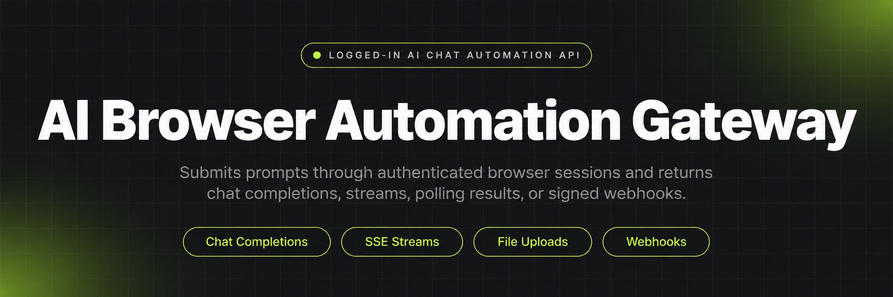
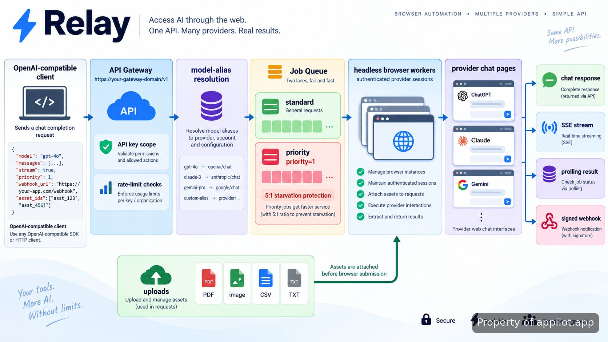

<p align="center">
  <a href="https://www.appilot.app" target="_blank" rel="nofollow">
    
  </a>
</p>

## Appilot's AI Browser Automation Gateway

Relay is the repository implementation behind **Appilot's AI Browser Automation Gateway**. It turns logged-in AI chat sessions into a programmable interface that accepts OpenAI-shaped requests, assigns them to browser workers, and returns results through synchronous calls, streaming, polling, or webhooks. Applications send chat-completion payloads to `https://your-gateway-domain/v1`; provider-specific work stays behind the gateway, so application code does not need a separate control path for each service. The repository is versioned at `v2.0.0`; operation is split between a dashboard, Python SDK, and REST endpoints. Relay is unofficial software. It uses authenticated browser sessions you control, not an affiliation with any AI provider.

> Turn logged-in AI chat sessions into programmable APIs, with an OpenAI-compatible interface.

<a href="https://www.appilot.app" target="_blank" rel="nofollow">
  
</a>

<p align="center">
  <a href="https://t.me/Bitbash333" target="_blank" rel="nofollow">
    
  </a>&nbsp;
  <a href="https://wa.me/923249868488?text=Hi%2C%20I%27m%20interested%20in%20Appilot." target="_blank" rel="nofollow">
    
  </a>&nbsp;
  <a href="mailto:hello@appilot.app" target="_blank" rel="nofollow">
    
  </a>&nbsp;
  <a href="https://www.appilot.app" target="_blank" rel="nofollow">
    
  </a>
</p>

## What the gateway routes

A request enters through the **OpenAI-compatible API** with a model alias, messages, and optional controls such as `stream=True`, `priority=1`, `webhook_url`, or asset IDs. Relay authenticates the key, checks permitted models, applies rate and usage limits, then queues the job. A browser worker assigned to the selected service opens its authenticated session, submits the prompt, captures the response, and normalizes it into the gateway contract. Streaming jobs emit server-sent events; non-streaming jobs can return through `client.run`, polling, or a webhook callback. Priority work uses `priority=1`, with **5:1 starvation protection** so standard jobs continue to move. Every call is written to the jobs log with full input and output history.

## Core features

| Feature | Description |
| --- | --- |
| Chat completions | Separate provider-specific browser steps from application code by accepting `client.chat.completions.create` requests through one OpenAI-shaped contract. |
| Streaming | Avoid waiting for a full browser response before showing output; `stream=True` returns real-time SSE events. |
| Vision and uploads | Remove manual file handling by accepting image URLs, base64 data, asset IDs, plus PDF, image, CSV, and TXT uploads. |
| One-line runs | Collapse submit, poll, and result retrieval into `client.run` when the caller does not need manual job control. |
| Priority queue | Keep urgent work ahead without permanently blocking normal traffic; `priority=1` uses 5:1 starvation protection. |
| Webhook callbacks | Remove client-side polling when a callback fits better; `webhook_url` receives the finished job and `RelayWebhook` verifies HMAC-SHA256 signatures. |
| Scoped keys and limits | Prevent one credential from reaching every configured model by scoping keys, then applying rate and usage limits per key. |
| Jobs log and cancellation | Make failed or unwanted work inspectable by storing full request and response history and allowing queued jobs to be cancelled. |

## Request path from client to browser

The workflow is linear. A caller sends a chat request with a configured model alias. The gateway checks the API key and limits, resolves the alias to a service, and creates a job. The queue chooses standard or VIP scheduling, then assigns an available headless browser worker with a valid service session. The worker submits the prompt, watches the response, and passes captured output back to Relay. The result can become a chat-completion response, SSE stream, polled result, or webhook. A concrete VIP example is `priority=1`; after five priority selections, the documented 5:1 protection gives standard work a turn. Uploaded PDF or image assets are attached before prompt submission rather than requiring a separate manual upload.



## Install and verify

Installation supports three paths: install the SDK from a local repository path, install a built wheel, or copy the SDK folder into an existing project. For a normal checkout, create an isolated environment, install from the repository root, and verify the SDK imports before pointing an application at the gateway. Keep session cookies and gateway keys out of shell history, examples, fixtures, and commits. Use placeholders such as `RELAY_API_KEY` and `https://your-gateway-domain`. Provider cookies belong in the configured secret store or runtime environment, not documentation, test data, screenshots, or issue reports. `installation.md` records the local-path, wheel, and copied-SDK variants without changing the API contract.

```bash
python -m venv .venv
source .venv/bin/activate
python -m pip install .
python -c "import relay; print('Relay SDK import OK')"
```

<a href="https://tally.so/r/yP5oDx?platform=GitHub&amp;format=Product+repo&amp;brand=Appilot&amp;niche=appilot&amp;page=AI+Browser+Automation+Gateway+with+OpenAI-Compatible+Clients&amp;date=2026-09-22" target="_blank" rel="nofollow">
  
</a>

## Quickstart with the OpenAI-compatible API

The smallest working integration uses an OpenAI client pointed at Relay rather than a provider endpoint. Set `https://your-gateway-domain/v1` as the base URL, supply a Relay API key, and use a model alias that exists in the dashboard. The caller knows the gateway contract and alias; Relay knows which browser service and worker satisfy it. Compatibility still has a clear boundary. The interface follows the familiar <a href="https://platform.openai.com/docs/api-reference/chat" target="_blank" rel="nofollow">ChatGPT / OpenAI API</a> shape, but execution uses a logged-in browser session, so UI behavior, account state, and session validity still matter. For teams replacing one-off browser wrappers, the practical test is whether existing chat-completion code can move to Relay by changing `base_url`, key, and configured alias instead of maintaining provider-specific controllers.

```python
import os
from openai import OpenAI

client = OpenAI(
    base_url="https://your-gateway-domain/v1",
    api_key=os.environ["RELAY_API_KEY"],
)

response = client.chat.completions.create(
    model="configured-alias",
    messages=[{"role": "user", "content": "Return three release risks."}],
)

print(response.choices[0].message.content)
```

## Dashboard controls for sessions, models, and keys

The dashboard is the operator side of Relay: it shows running browsers, active services, and usage, then exposes the controls that determine what requests are allowed to run. Browser workers are managed separately from services, so an operator can see whether capacity is missing or a provider session is the actual problem. Services can be added, enabled, or disabled for <a href="https://platform.openai.com/docs/api-reference/chat" target="_blank" rel="nofollow">ChatGPT / OpenAI</a>, <a href="https://docs.anthropic.com/en/api/messages" target="_blank" rel="nofollow">Claude</a>, <a href="https://api-docs.deepseek.com/api/create-chat-completion/" target="_blank" rel="nofollow">DeepSeek</a>, <a href="https://ai.google.dev/api/generate-content" target="_blank" rel="nofollow">Gemini</a>, <a href="https://docs.x.ai/developers/models" target="_blank" rel="nofollow">Grok</a>, and <a href="https://www.kimi.ai/help/kimi-api/api-overview" target="_blank" rel="nofollow">Kimi</a>. **Session cookie login** connects the provider account without putting credentials into application code. The models page maps provider models to aliases. The API-key screen creates, lists, and revokes keys scoped to those models; the limits page sets rate and usage limits per key; and the jobs log keeps the complete request and response record for every API call.

## SDK jobs, streaming, uploads, and callbacks

The **browser automation SDK** exposes both convenient and explicit job control. `client.run` is the short path when the caller wants submit, poll, and return in one call. `client.chat.completions.create` is the compatibility path, including `stream=True` for SSE. `client.upload` creates assets for PDF, image, CSV, or TXT attachments; vision requests can also reference an image URL or base64 data. Manual polling is available when the application owns its retry loop, and queued work can be cancelled before a browser starts it. Webhooks cover the opposite case: provide `webhook_url`, receive the result callback, then use **webhook verification** through `RelayWebhook` to check its HMAC-SHA256 signature before trusting the body. Typed exception classes keep authentication, validation, limits, provider failures, and job-state problems distinguishable. Those boundaries matter because a browser session can fail for reasons that do not look like normal HTTP-provider errors.

| Method or field | Parameters | Returns or effect |
| --- | --- | --- |
| `client.chat.completions.create` | `model`, `messages`, `stream`, optional job controls | OpenAI-shaped completion or SSE iterator |
| `client.run` | Prompt/request plus supported job options | Final result after submit and polling |
| `client.upload` | PDF, image, CSV, or TXT file | Asset ID for later request attachment |
| `priority` | `1` for VIP scheduling | Priority-queue placement with 5:1 protection |
| `webhook_url` | HTTPS callback URL | Finished job posted to the callback |
| `RelayWebhook` | Payload, signature, secret | Verified callback or typed verification error |

## Repository map and project policies

The repository separates operator documentation from SDK/API documentation. Dashboard pages cover browsers, services, cookie login, model aliases, **API key limits**, and **job history**. SDK pages cover installation, quickstart, chat completions, streaming, vision, `run`, uploads, the **priority job queue**, webhooks, verification, polling, cancellation, typed errors, REST endpoints, and the SDK reference. Project files document contribution setup and branch naming, the selected license, history starting at `v2.0.0`, vulnerability reporting, issue templates, and the disclaimer. `DISCLAIMER.md` states that Relay is unofficial, is not affiliated with AI providers, and may conflict with provider terms of service. Two external baselines for reviewers are Postman's <a href="https://www.postman.com/state-of-api/2025/" target="_blank" rel="nofollow">2025 State of the API</a> and <a href="https://www.postman.com/report/security-state-of-the-api-2025/" target="_blank" rel="nofollow">2025 State of the API for Security</a>.

```text
relay/
├── README.md
├── docs/
│   ├── dashboard.md
│   ├── browsers.md
│   ├── services.md
│   ├── cookie-login.md
│   ├── models.md
│   ├── api-keys.md
│   ├── limits.md
│   ├── jobs-log.md
│   ├── installation.md
│   ├── quickstart.md
│   ├── chat-completions.md
│   ├── streaming.md
│   ├── vision.md
│   ├── run.md
│   ├── uploads.md
│   ├── priority-queue.md
│   ├── webhooks.md
│   ├── webhook-verification.md
│   ├── polling.md
│   ├── cancellation.md
│   ├── errors.md
│   ├── rest-api.md
│   └── sdk-reference.md
├── sdk/
│   └── relay/
│       ├── __init__.py
│       ├── client.py
│       ├── errors.py
│       └── webhooks.py
├── CONTRIBUTING.md
├── CHANGELOG.md
├── SECURITY.md
├── DISCLAIMER.md
├── LICENSE
└── .github/
    └── ISSUE_TEMPLATE/
        ├── bug_report.md
        └── feature_request.md
```

## How to Run a Prompt Using Appilot's AI Browser Automation Gateway

- **STEP 1 — Get the build ready.** Check out the Relay repository, install the SDK using the documented local, wheel, or copied-folder path, and keep all real secrets outside the repository.
- **STEP 2 — Connect a provider session.** Open the dashboard, start a browser worker, enable the required service, and add the authenticated session cookies for the account you control.
- **STEP 3 — Configure access.** Map the service model to an alias, create a key scoped to that model, and set the rate and usage limits that key may consume.
- **STEP 4 — Send the job.** Call `client.chat.completions.create` or `client.run`; read the direct response, SSE stream, polled result, or verified webhook in your application.

## FAQ

### Does Relay call provider APIs directly?

No. Relay exposes an OpenAI-compatible gateway to your application, but the configured provider work is carried out through logged-in browser sessions. That distinction is central to the design: your code talks to Relay, while browser workers handle the service UI and normalize the captured result back into the gateway response.

### How are provider accounts connected?

Provider accounts are connected through session cookies managed from the dashboard. Cookies are runtime secrets and should never be committed to the repository, pasted into examples, or included in issue reports. API keys used by callers are separate credentials and can be scoped to specific configured models with their own rate and usage limits.

### What happens when a provider changes its web interface or terms?

A provider-side change can break browser automation even when Relay's public API has not changed. The affected service integration must be updated and revalidated before relying on it again. Relay is unofficial, is not affiliated with any listed AI provider, and its use may conflict with provider terms of service, so deployments need their own policy and account review.

<table>
  <tr>
    <td align="center" width="33%">
      
      <p>This scraper helped me gather thousands of posts effortlessly. The setup was fast, and exports are super clean and well-structured.</p>
      <p><b>Nathan Pennington</b><br>Marketer<br>★★★★★</p>
    </td>
    <td align="center" width="33%">
      
      <p>What impressed me most was how accurate the extracted data is. Likes, comments, timestamps — everything aligns perfectly.</p>
      <p><b>Greg Jeffries</b><br>SEO Affiliate Expert<br>★★★★★</p>
    </td>
    <td align="center" width="33%">
      
      <p>It's by far the best tool I've used. Ideal for trend tracking, competitor monitoring, and influencer insights.</p>
      <p><b>Karan</b><br>Digital Strategist<br>★★★★★</p>
    </td>
  </tr>
</table>